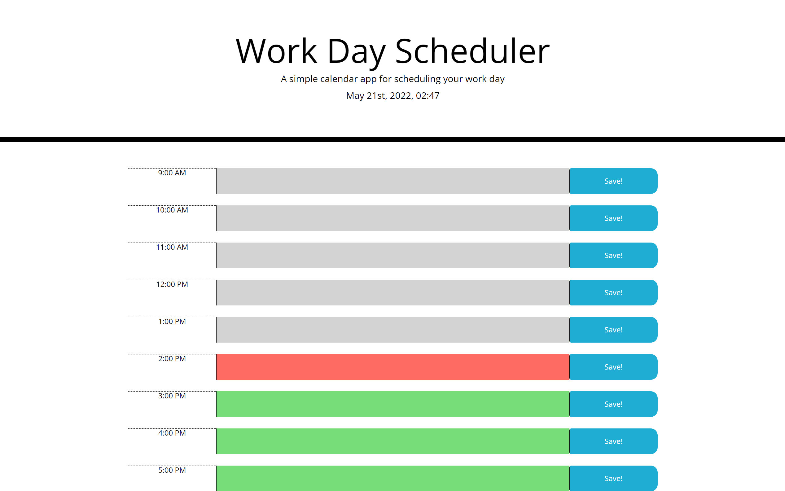

# dayScheduler

## Website description

I edited the HTML to display everything bellow the header. And created the JS file to make a daily scheduler that will display the time and date, will color code the input boxes according to if it's past that time or not, and will save inputs into local storage and render them when refreshed.

I had to constantly look up syntax for jQuery as I just hadn't done much with it prior to this. I also made the mistake of naming every button the same ID which made it impossible to save with any but the first. 

## Features

1. will display date and time in header
2. will colorcode the input boxes according to time and whether they are past/present/future
3. will save anything you want to save and render it back when you refresh the page

# Link to page

<a href = "https://jgood13.github.io/dayScheduler/"
target="_blank"> Deployed Webpage </a>

# Screenshot

